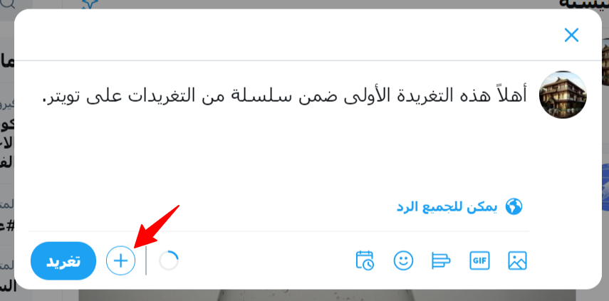
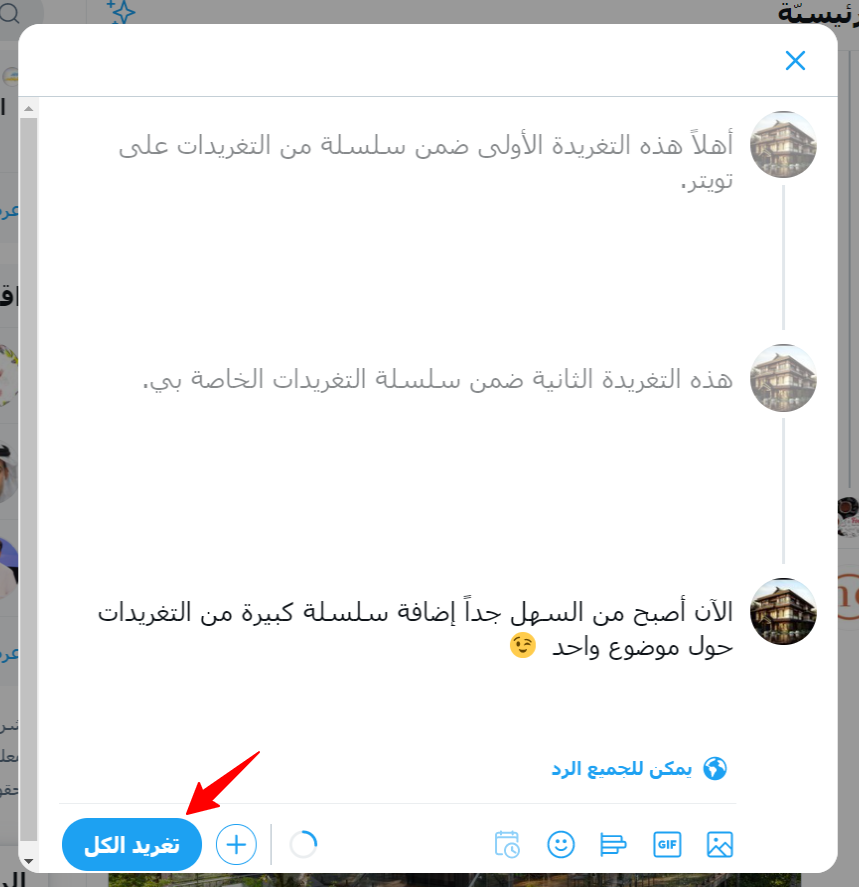

طريقة عمل سلسلة تغريدات على تويتر Twitter thread

إذا كنت متابع في تويتر وتجلس في تويتر ساعات (مثلي) فحتماً إنك رأيت سلسلة تغريدات متواصلة عن موضوع معين، وهذه خاصية رائعة من تويتر تسمح لك بذكر سلسلة من النقاط المتتابعة بخصوص موضوع محدد.

  

في هذا الموضوع اقدم لك شرح مصور لكيفية عمل هذه السلسلة من التغريدات على تويتر.

  

## كيف تنشر سلسلة تغريدات على تويتر (Twitter thread)

  

1.  اضغط على "تغريد" لإنشاء تغريدة جديدة.
    
2.  اكتب أول تغريدة من موضوعك. انقر فوق الزر الجديد "إضافة تغريدة أخرى" وستظهر نافذة تغريدة ثانية.
    

3.  يمكنك نشر الموضوع بالكامل في نفس الوقت باستخدام الزر "تغريد الكل". يمكنك أيضًا إضافة سلسلة رسائل إلى تغريدة منشورة مسبقًا باستخدام الزر نفسه "إضافة تغريدة أخرى".
    

  

يتيح لك نشر سلسلة تغريدات فرصة لإعطاء المتابعين الشعور بالإثارة لقصة متطورة - وهو أمر مثالي لحدث مباشر أو تسلسل مستمر من الأفكار . إن نشر سلسلة رسائل كاملة دفعة واحدة يمنح متابعيك قصة كاملة الشكل - وهو الخيار المناسب لإيصال الرسالة التي تريد إيصالها بشكلها المناسب، مثل إعلان عن منتج لشركة تقدم منتج معين أو قصة قصيرة عن حادثة وقعت معك.