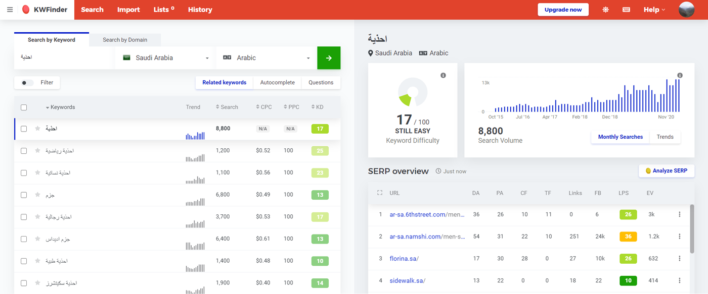
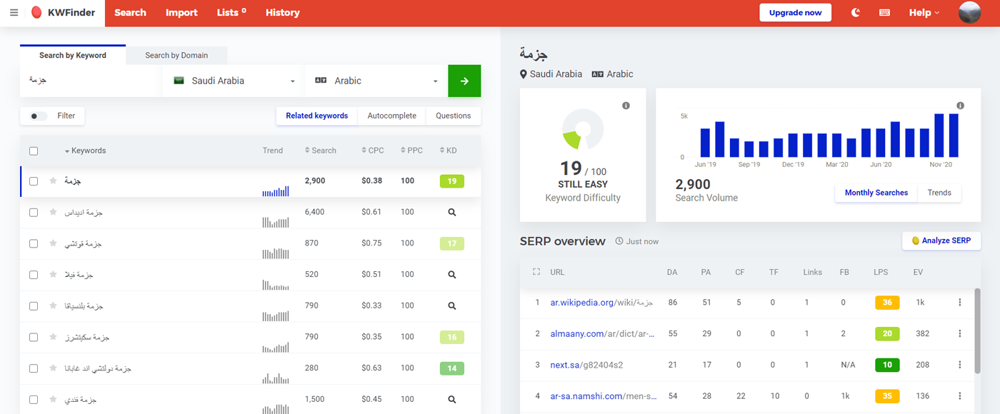
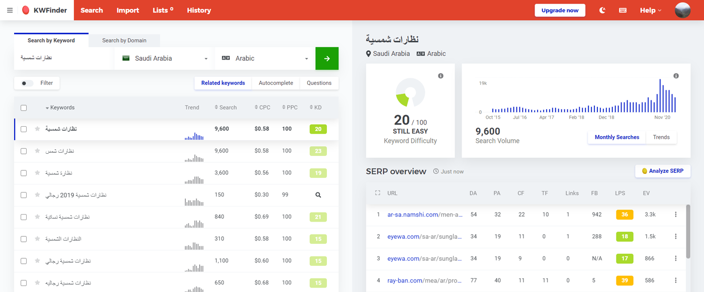

import Note from '../../components/Note';

## كيف تبدأ بالتجارة الإلكترونية ؟

لبدء تأسيس تجارتك الإلكترونية فإنه عليك إنفاق الكثير من الوقت والعمل بالإضافة إلى المعلومات التي يجب أن تكون مطلع عليها حتى تستطيع إنشاء متجرك بأقل عدد من المشاكل.

  

### - لماذا تبدأ تجارة إلكترونية؟

    

بالأرقام أصبحت التجارة الإلكترونية اليوم هي الطريقة الأسرع التي تمكن تقريباً أي شخص من بيع منتجاته بسهولة دون الحاجة إلى إنفاق مبالغ على تأجير المحل وديكور ووظائف، فهو على عكس المتاجر التقليدية يمكنك من البدء برأس مال صغير وتركيز جهدك على شراء وتسويق المنتجات، بالإضافة إلى ذلك فإن الاستثمار في متجر إلكتروني يمكنك من نشر منتجاتك لآلاف وربما لملايين من الناس بسرعة كبيرة إذا استثمرت فيه بشكل مناسب وسليم.

  

في هذا الموضوع سنناقش ما هي الخطوات التي عليك القيام بها لبدء متجرك، بتكاليف مختلفة وطرق مختلفة.

  

## حدد نوع التجارة الإلكترونية

التجارة الإلكترونية ليست فقط مقتصرة على البضائع الملموسة بل تشمل كل شيء تقريباً مثل الخدمات والدورات التدريبية وغيرها من منتجات رقمية واستشارات .. إلخ.

  

وأفضل ما في الأمر أنه اليوم أصبح هناك أكثر من 2 مليار مشتري( [المصدر](https://www.statista.com/statistics/251666/number-of-digital-buyers-worldwide/#:~:text=In%202021,%20over%202.14%20billion,global%20digital%20buyers%20in%202016.&text=Purchasing%20goods%20and%20services%20online,many%20people%20around%20the%20world.)) بزيادة أكثر من 25% عن عام 2016، وهذا يعني أن التجارة الإلكترونية لا تزال في مرحلة النمو السريع وأفضل وقت للإستثمار في بناء متجرك الإلكتروني هو الآن.

الآن ما هو المنتج الذي يمكنك أن تبدأ به التجارة الإلكترونية؟

هناك أربعة أنواع رئيسية من المنتجات التي تقوم يمكنك بيعها عبر الإنترنت.

1.  البضائع المادية الملموسة (المنقولة)، وهناك عدد من المتاجر القائمة وتحقق نجاح كبير مثل موقع سوق، نون، نايس ون.
    
2.  السلع الرقمية ( مثل الكتب الرقمية، الصوتيات والمرئيات مثل الدورات والبرامج الترفيهية، والتطبيقات)، ومن أمثلة المواقع التي تقدم السلع الرقمية: موقع يودمي، أكاديمية حسوب.
    
3.  الخدمات، في هذه النقطة تقريباً كل شيء لا يندرج تحت باقي الأنواع مثل خدمات الاستضافة والبرمجة وغيرها وهذا المجال ضخم وله تفاصيل كثيرة.
    
4.  الدورات والاشتراكات و العضويات المدفوعة، هذا التصنيف يندرج ضمن الخدمات لكن بنموذج ربحي مُميز فهو يعتمد على بناء الخدمة مرة واحدة ثم تقديم هذه الخدمة على نطاق واسع و يكون بنظام دفع مبلغ شهرياً للحصول على هذه الخدمة القائمة ومن أمثلتهاخدمة نتفلكس، سبوتيفاي وغيرها من الخدمات التي بدأت بالظهور وتتبع نفس النموذج الربحي.

يمكنك البدء بتنفيذ واحدة أو حتى كل هذه الخدمات إذا أردت لكن من الأفضل دائماً هو التركيز والتخصص.

البدء في التجارة الإلكترونية يحتاج إلى طرح الكثير من الأسئلة لذا سأبدأ بالأسئلة التالية (سأجيب عليها في سياق الموضوع) لتفهم بشكل سريع ما هي التجارة الإلكترونية وما يجب عليك الإجابة عليه لتبدأ.

-   ما هو المنتج الذي تبيعه؟
    
-   ما هي المنصة المستخدمة؟
    
-   كيف الحصول على المنتج ؟ وكيف تخزين المنتج (في حال كان منتج مادي -ملموس-)؟
    
-   ما هو الجمهور المستهدف؟
    
-   كيف توصل المنتج إلى عملائك ( الشحن والتوزيع) ؟
    
-   ما هي طرق الدفع ؟
    

هذه الأسئلة وغيرها عليك البحث والتقصي عنها بشكل جيد لتبدأ بالتجارة الإلكترونية، هنا سأناقش هذه الأسئلة بناءاً على السوق العربي في التجارة الإلكترونية.

## ما هو المنتج الذي تبيعه ؟

اختيار المنتج هو الخطوة الأولى، لكن السؤال كيف أختار المنتج وما هو المنتج الذي يحتاجه الناس، ما هي المنتجات التي قد يحتاجها الناس في منطقة معينة وعن ماذا يبحثون هناك تبدأ الأمور بالوضوح وهو ابحث عن ما يحتاجه الناس وحاول أن تقدمه لهم، لحسن الحظ في السنوات الأخيرة هناك الكثير من البرمجيات والأدوات التي تساعدنا في معرفة عن ماذا يبحث الناس وأين يجدونه وهل يوجد منافسة قوية في هذا القطاع أم يمكنني المنافسة فيه بسهولة.

فمثلاً باستخدام [KWFinder](https://kwfinder.com#a5feb7326feebf83d108c1122) يمكنك معرفة كم مرة يتم البحث عن كلمة معينة وهل هناك منافسة قوية وما هي أهم المواقع التي تحصل على زيارات من هذه الكلمة وغيرها الكثير من التفاصيل التي تساعدك في اتخاذ قرار مدروس (الخدمة ليست مجانية لكن هناك تجربة مجانية لمدة 10 أيام اعتقد ستكون كافية للحصول على فكرة مبدئية عن ما هو المنتج الذي قد تريد البدء فيه) .

جميع النتائج لعمليات البحث في المملكة العربية السعودية.

البحث عن كلمة أحذية 8800 مرة

بينما البحث عن جزمة 2900 مرة

البحث عن النظارات الشمسية 9600 مرة

  

  

طبعاً هناك الكثير من التفاصيل التي يقدمها لك الموقع وانصحك بتجربة الإشتراك فيه.
  

الطريقة الثانية هي باستخدام [جوجل ترندز](https://trends.google.com/trends) وهي خدمة مجانية تقدمها جوجل لمعرفة مدى أهتمام الناس بكلمات مفتاحية معينة، لكن هذه الخدمة قد لا تعطيك الكثير من التفاصيل التي قد تحتاجها خصوصاً للعمل بشكل تجاري.
  

الآن لنفترض أنك ستؤسس متجر إلكتروني لبيع الأحذية، السؤال الآن ما نوع الأحذية التي ستبدأ في بيعها لأن الأحذية ليست نوع واحد بل أنواع هناك الأحذية الرياضية بأنواع مختلفة هناك احذية الخاصة بالعمل،وأحذية الـGYM و أحذية نسائية بأنواع مختلفة أحذية أطفال أيضاً بأنواع مختلفة وغيرها الكثير من التفاصيل، أو ربما ترغب في بيع كل أنواع الأحذية في موقعك في هذه الحالة سيكون عليك أن تتعامل مع أنواع مختلفة من الأحذية بخامات مختلفة وتصنيع مختلف، فهناك الكثير من التفاصيل التي سيكون عليك الإطلاع عليها والبحث عنها حتى لا تجد نفسك في دوامة.

<Note noteText="ملاحظة: من الأفضل أن يكون عملك في البداية متخصص ثم تتوسع تدريجياً حتى يكون لك خبرة في المجال." />

  

## ما هي المنصة المستخدمة ؟

ما هي المنصة التي ستستخدمها لعرض المنتجات؟ هل تستخدم منصات جاهزة أم تجهز موقع خاص بك؟ -هذا الموضوع له الكثير من التفاصيل وسأتحدث عنه في موضوع منفصل-

  

هناك الكثير من المنصات المجانية والمدفوعة التي يمكنك بدء تجارتك الإلكترونية منها أو حتى عن طريق حساب تواصل إجتماعي مثل إنستغرام او تويتر وفيسبوك وسنابشات وغيرها من وسائل التواصل الإجتماعي.

  

سأركز هنا فقط على المنصات المتخصصة التي يمكنك منها البدء في التجارة الإلكترونية.

أولاً المنصات الجاهزة: منصة [زد](https://zid.sa/)، منصة [سلة](https://salla.sa/site/)، منصة [اكسباند كارت](https://www.expandcart.com/ar/)، كل هذه المنصات توفر لك خدمة تجهيز متجر مناسب لبيع منتجاتك عبر الإنترنت بعضها يقدم تجربة مجانية وبعضها لا يقدم.

ثانياً المنصات المخصصة:  هنا اقصد المنصات او السكربتات (البرمجيات) التي تحتاج إلى عمل منك لتجهيز موقعك بشكل مناسب لعرض منتجاتك او تستطيع الدفع لمطور مواقع ليصمم لك متجرك الإلكتروني الخاص بك مثل: WooCommerce [ووكومرس](https://woocommerce.com/)، OpenCart [اوبن كارت](https://www.opencart.com/)، Magento [ماجنتو](https://magento.com/).

أخيراً البرمجة الخاصة في حال أردت إنشاء متجر إلكتروني ضخم فإن الخيارات المتاحة لن تكون ملائمة، فالخيار الأفضل سيكون بالبحث عن شركة تقدم لك برمجة خاصة لإنشاء متجرك الإلكتروني، أغلب المنصات التجارية الضخمة تبنى على برمجة خاصة لأسباب مختلفة سأناقشها معكم في موضوع منفصل عن المتاجر الإلكترونية.

## كيف الحصول على المنتج ؟ وكيف التخزين؟

قررت ما هو المنتج الذي تريد البدء فيه، الآن عليك البحث عن مصدر لشراء المنتج بسعر مناسب تستطيع بيعه لعملائك وتحقيق مكسب لكي تستطيع الإستمرار، هل ستقوم بتصنيع المنتج بنفسك ؟ هل تشتري المنتج من السوق (سوق الجملة )؟ هل تستورد المنتج بنفسك أم تتصل بوكيل للمنتج لشراء كمية من المنتج؟

أين سيكون تخزينه هل تحتفظ فيه داخل مخزن خاص بك، هل تستأجر مساحة من إحدي شركات التخزين، هل ستشتري فقط عند طلب الزبون وارسال المنتج إليه مباشرة مثل مبدأ الـ Dropshipping ؟ هذه الأسئلة وغيرها الكثير من الأمور يجب عليك التفكير بها وحسابها عند التخطيط في التجارة الإلكترونية.

  

## من هو الجمهور المستهدف؟

الآن بعدما قررت ما هو المنتج الذي تريد بيعه وكيف ستكون عملية شرائه وتخزينه، الآن نأتي لعملية البيع، ما هو الجمهور المستهدف بهذا المنتج، هل المنتج شيء أساسي ام منتج كمالي، ما هو سن الجمهور المستهدف أين مكان هذا الجمهور المستهدف؟ كيف توصل إليه وتعرفه بوجود المنتج -هذه النقطة تحتاج إلى الكثير من العمل وهي النقطة الفاصلة بين النجاح والفشل-، هناك الكثير من الأمور لاستهداف الجمهور بشكل مناسب وسريع.

  

1.  الإعلانات عبر وسائل التواصل الإجتماعي (تويتر، فيسبوك، إنستغرام، يوتيوب، سناب شات .. إلخ)
    
2.  الإعلان لدى المشاهير في وسائل التواصل الإجتماعي
    
3.  الإعلان في محركات البحث (تحديداً جوجل ادوردز)
    
4.  نشر محتوى عن المنتج عبر الإنترنت (طريقة بطيئة لكن فعالة على المدى الطويل)
    
5.  توزيع عينات من المنتج على أصحاب المدونات لكتابة مراجعة عن المنتج في مدوناتهم.
    

  

كل من الطرق المذكورة تحتاج إلى الكثير من التفصيل لكن ليست موضوعنا اليوم سأتحدث عنها في موضوع منفصل قريباً.

## كيف توصل المنتج إلى عملائك ؟

الآن بدأت بتحقيق المبيعات كيف ستوصل المنتج إلى العميل، هل ستقوم بإيصاله بنفسك ؟ أم ستستخدم إحدى شركات الشحن الموجودة في السوق مثل DHL، فيديكس، ارامكس أو البريد المحلي إلخ.. ؟

هل ستقدم توصيل مجاني للكميات؟ ما هي أسرع طريقة لتوصيل المنتج ما هي سياسة الاسترجاع والاستبدال؟ كل هذه النقاط يجب أن تضعها في الحسبان عند بداية تحقيق المبيعات ويجب أن تكون واضحة للعميل من البداية.

  
<Note noteText="ملاحظة تقديم شحن مجاني في البداية هي واحدة من أفضل الاستراتيجيات لتحقيق مبيعات في بداية التجارة الإلكترونية." />

## ما هي طرق الدفع؟

لفترة من الزمن كانت واحدة من أصعب الأشياء في التجارة الإلكترونية هو طرق الدفع، لكن اليوم أصبحت طرق الدفع المتوفر رائعة وبسيطة وسريعة فأصبح بإمكان الجميع تقريباً بشراء منتج من الإنترنت دون الحاجة إلى الكثير من التعقيد، بداية من البطاقات الإئتمانية و بايبال و بيفورت وبطاقات الدفع المسبق خدمات الدفع المقدمة من شركات الإتصالات في أغلب الدول العربية. وأخيراً الدفع عند الإستلام.

  

## الملخص

بدء التجارة الإلكترونية هو عمل مثل أي عمل آخر ليس شيء يمكنك عمله ببال مسترخي، ولكي تنجح فيه عليك أن تعمل لساعات وأيام في البحث والتقصي والسعي فيه، وأجزم أنه قد يكون أصعب من العمل في التجارة التقليدية لأنك ستتعامل مع مشاكل جديدة لا تمر على المتاجر التقليدية ولكن في المقابل التجارة الإلكترونية ستوفر لك فرصة لتحقيق نجاح على نطاق أوسع والتوسع فيها في الأغلب يكون بسرعة أكبر وبمجرد أن تبدأ بوادر النجاح فإن الأمور في أغلب ستكون أفضل، فأنت تكتسب الخبرة بشكل تدريجي ومستمر، بالإضافة إلى كل ذلك يمكنك العمل تقريباً من أي مكان فأنت لا تحتاج أن تظل حبيس بقعة محددة فمع تحسن الإنترنت أصبح بإمكانك القيام بأغلب الأعمال حتى من منطقة مختلفة أو أثناء سفرك.

  

لنعيد ذكر الخطوات التي نحتاجها لبدء التجارة الإلكترونية مرة أخرى

1.  تحتاج أن تحدد ما هو المنتج الذي تريد بيعه سواء عن طريق إستخدام الخدمات الإلكترونية أو بالتقصي على الأرض وسؤال الناس
    
2.  حدد ما هي المنصة التي ستستخدمها لبدء التجارة الإلكترونية وما هي رؤيتك للمشروع هل سيكون مشروع بسيط تبيع فيه عدد محدد من المنتجات أم ستتوسع بشكل مستمر لبيع المزيد والمزيد من المنتجات، هل ستستخدم برمجية جاهزة مثل زد أم برمجية مثل WooCommerce التي قد تحتاج بعض التجهيز ليكون متجرك جاهز أم هل ستحتاج برمجة خاصة؟
    
3.  البحث عن مصادر للمنتج هل ستشتريه أم تصنعه، في حال أنك ستشتريه ما هي المصادر التي يمكنك الشراء منها وما مدى الربحية في كل منها ؟
    
4.  نشر منتجك على الإنترنت ليس كافياً عليك الإعلان عن منتجك (بطرق مشروعة) مثل استخدام منصات التواصل الإجتماعي أو محرك البحث جوجل أدوردز أو حتى الإعلان عبر التلفزيون او يافطات في الشوارع!
    
5.  توصيل المنتج عن طريق شركات الشحن أو تتفق مع أشخاص لإيصال المنتج بالنيابة عنك، هل تبيع كميات بسيطة أم تنوي البيع بكميات كبيرة؟ هل ستقدم توصيل مجاني؟
    
6.  توفير أكثر من طريقة للدفع تساعد كثيراً في تسهيل قرار الشراء على الكثير من الناس فمن الأفضل توفير العديد من الإختيارات للعملاء للشراء من موقعك وأنصح بتوفير خدمة الدفع عند الإستلام لأنها تعطي المزيد من الثقة في المتجر.
    

  

هذه النقاط وغيرها الكثير من التفاصيل التي تظهر عند بدء التجارة الإلكترونية، الأهم من هذا هو أن تتخذ القرار ببدء التجارة الإلكترونية وتبدأ بالتنفيذ وهذه هي الطريقة الوحيدة التي ستعرف وتتعلم فيها المزيد عن التجارة الإلكترونية.